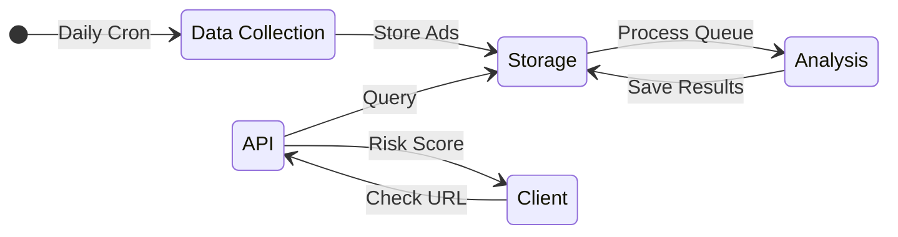
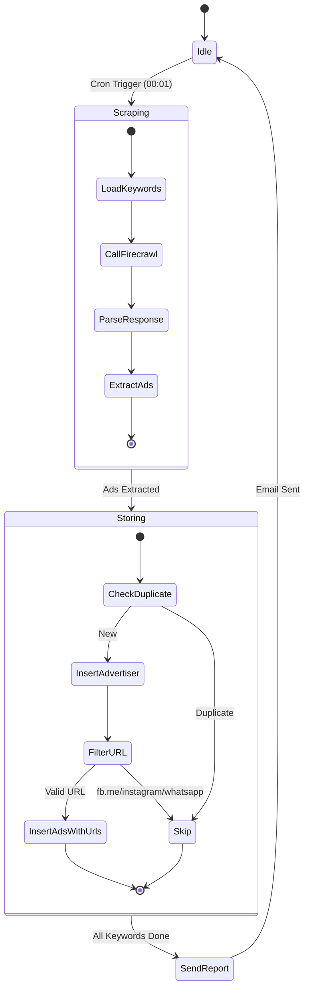
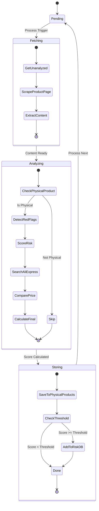
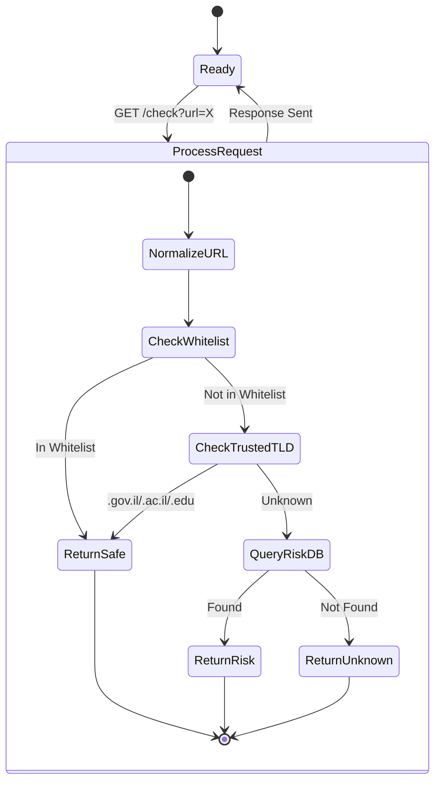
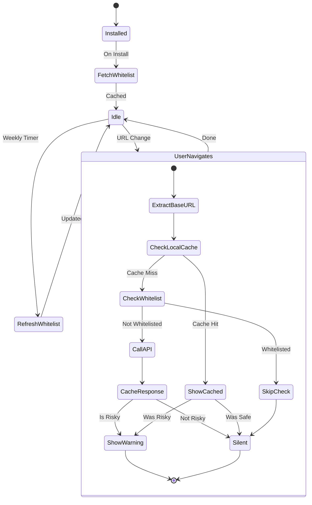
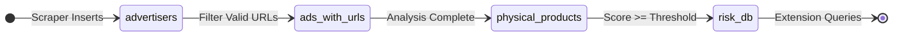

# Adora - Component State Machine Diagrams

## System Overview

---

## Component 1: Data Collection Pipeline

---

## Component 2: Analysis Engine

---

## Component 3: REST API

---

## Component 4: Chrome Extension

---

## Database State Flow

