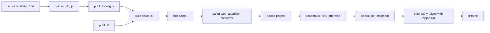

# iOS / Safari Extension

Adora ships as a Chrome MV3 extension and, from the same source, as a Safari Web Extension
wrapped in an iOS app. Both builds come from `extension/public/` — there is no separate
Safari source tree.

## Build pipeline



`npm run build:safari` covers the first three steps. The rest requires macOS with Xcode.

## How the Safari build differs

`build-safari.js` copies `public/` to `dist-safari/` and applies exactly two manifest changes:

| Field | Reason |
|---|---|
| `key` removed | Chrome-only field; `safari-web-extension-converter` rejects it |
| `identity` permission removed | `chrome.identity` does not exist in Safari |

No source files are branched or duplicated. Behaviour differences are resolved at runtime.

## Auth capability detection

Safari implements neither `chrome.identity` nor `launchWebAuthFlow`, so the Google OAuth
sign-in cannot complete there. The login screen previously gated the entire panel, which made
the Safari build show nothing but an unusable sign-in button.

Detection cannot happen in the content script: `chrome.identity` is not exposed to content
scripts even in Chrome, so its absence proves nothing. The background service worker *can*
see it. So:

1. `background.js` answers a `GET_CAPABILITIES` message with `authSupported`
2. `content.js` queries it once during `init()`, before the first render
3. Render paths gate on `authSupported` in addition to `authUser`

Chrome is unaffected — `authSupported` resolves true and behaviour is identical.

### Feature availability

| Feature | Chrome | Safari / iOS |
|---|---|---|
| Site detection, risk verdict, banner | ✅ | ✅ |
| Price-match results | ✅ | ✅ |
| Savings tracking | ✅ | ✅ |
| Theme / language toggle | ✅ | ✅ |
| Google sign-in | ✅ | ❌ no `chrome.identity` |
| Feedback voting (👍/👎) | ✅ | ❌ requires a user token |
| Community reports | ✅ | ❌ requires a user token |

The core flow authenticates with `X-API-Key` only, so it works fully logged-out. Auth-dependent
UI is hidden rather than shown disabled — dead controls in a demo are worse than absent ones.

**When adding auth-dependent UI, gate it on `authSupported`, not only on `authUser`.**

## Viewport constraints

The panel is fixed-position at `top/right: 16px`. On a phone the previous fixed
`width: 420px` exceeded the viewport (~375–393 CSS px) and was clipped. Current rules:

- `width: min(420px, calc(100vw - 32px))`, with the plain `420px` retained above it as a fallback
- `max-height: 80dvh` in addition to `80vh` — iOS Safari's `vh` ignores collapsing toolbars
- Saved drag positions are clamped to the viewport in `createWidget()`, so a position stored on
  a wider screen cannot strand the widget off-screen

## Distribution constraints

Sideloading with a free Apple ID:

- **The signature expires after 7 days.** The app stops launching until re-signed. Re-signing
  reuses the existing `.ipa` and takes minutes; no rebuild is needed.
- **Developer Mode** must be enabled on the device (Settings → Privacy & Security), which
  requires a reboot. One-time.
- The host app must be **launched once** before iOS registers the extension with Safari.
- Enable under Settings → Apps → Safari → Extensions, then grant all-sites permission.
- Windows needs Apple Mobile Device Support and Apple Application Support. Installing iTunes is
  neither sufficient nor necessary — install those two components directly.
- Do not use Sideloadly's *Remove App Extensions (PlugIns)* action; it strips the `.appex`,
  which is the entire product.

## `API_BASE` is baked in at build time

`config.js` is generated at build time and embeds `API_BASE`. A deployed `.ipa` therefore
targets one fixed API hostname. If the tunnel hostname changes, installed builds break and
recovery requires a full rebuild — not a re-sign.

Before relying on an existing build, verify the endpoint still answers:

```
curl -s -o /dev/null -w "%{http_code}" "$API_BASE/health"
```

A named tunnel with a stable hostname removes this failure mode. An ephemeral hostname also
blocks OAuth, since Google requires redirect URIs to be pre-registered exactly.

## Restoring sign-in on Safari (not implemented)

`chrome.identity` is the only missing piece; the rest of the auth chain already works, since
`POST /auth/google` accepts a Google token and returns the app JWT.

A workable approach avoids `chrome.identity` entirely:

1. Background opens a normal tab to Google's OAuth endpoint using **authorization code + PKCE**
   (the implicit flow is deprecated for web clients)
2. `redirect_uri` points at a **static page on a stable host** — it does not need to be the API
3. `content.js` already matches `https://*/*`, so it runs on that page and forwards the code
4. Background posts the code to a backend endpoint that exchanges it with Google

Only the static redirect page needs registering with Google, so the API hostname stays
irrelevant to auth. Setting `authSupported` true then restores voting and reporting with no
further UI changes.

Note that each on-device test costs a full convert + build + sideload cycle. Develop against
desktop Safari first, where extensions reload in seconds.
